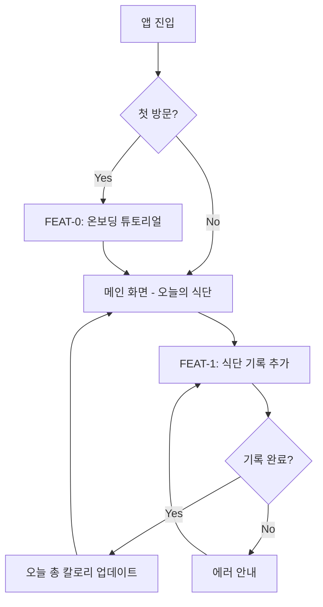
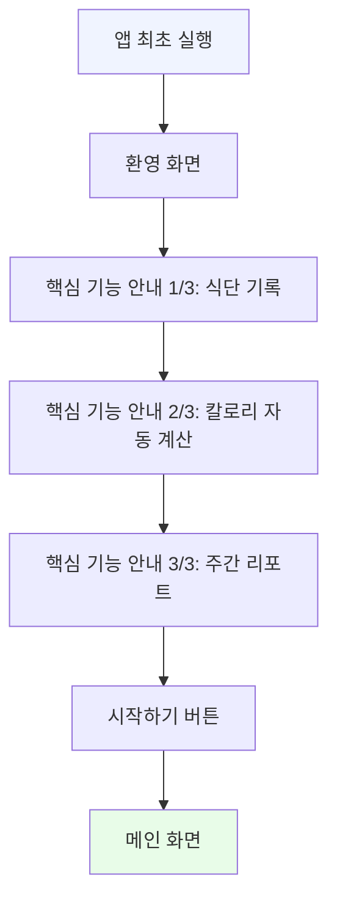
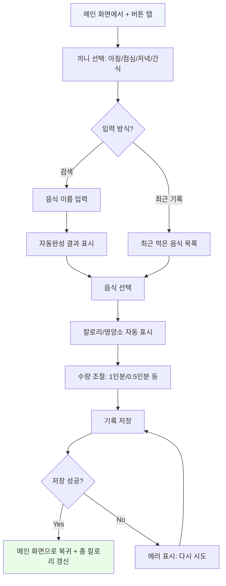
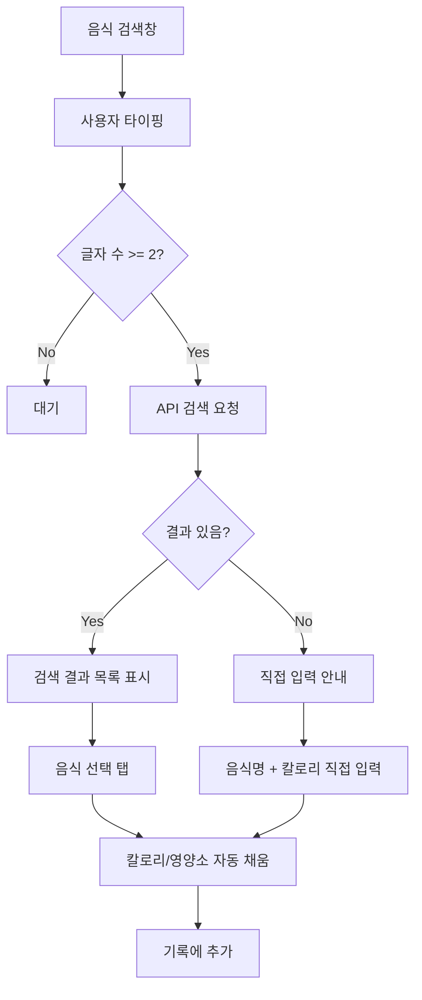
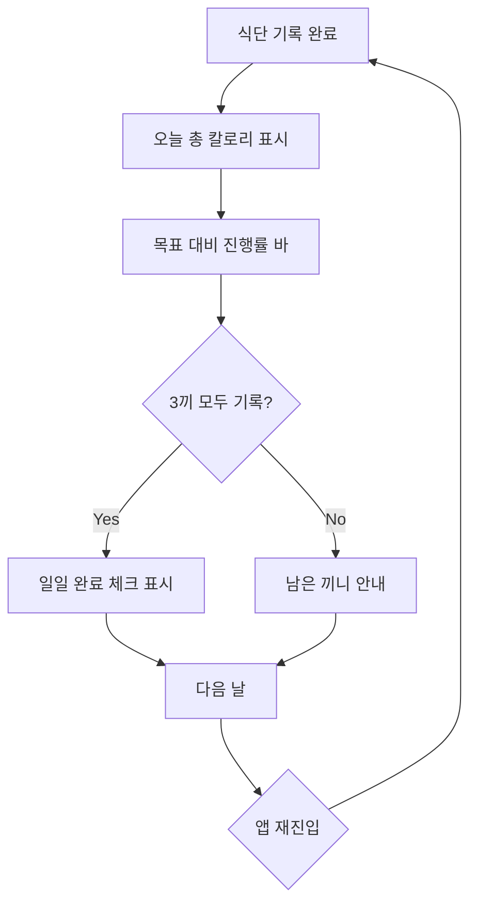
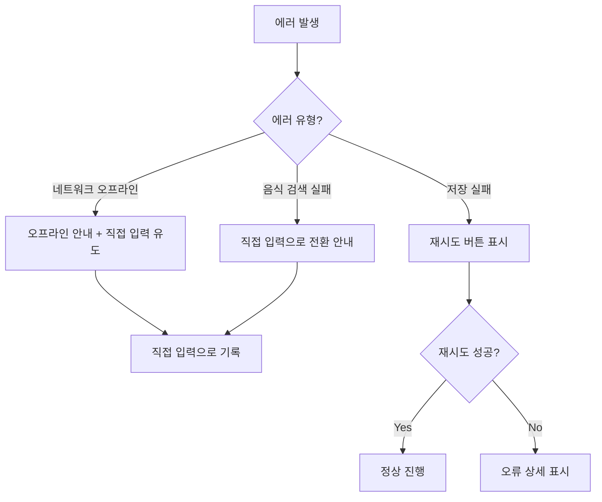

# User Flow (사용자 흐름도) - 헬스메이트

> Mermaid 플로우차트로 핵심 기능의 주요 여정을 표현합니다.

---

## MVP 캡슐

| # | 항목 | 내용 |
|---|------|------|
| 1 | 목표 | 귀찮은 입력 과정을 간소화하여 식단을 꾸준히 기록할 수 있게 하기 |
| 2 | 페르소나 | 다이어트 중인 사람 |
| 3 | 핵심 기능 | FEAT-1: 간편 식단 기록 |
| 4 | 성공 지표 (노스스타) | 매일 3끼 기록 달성률 |
| 5 | 입력 지표 | 일일 기록 횟수, 주간 연속 기록 일수 |
| 6 | 비기능 요구 | 식단 입력 3초 이내 완료 |
| 7 | Out-of-scope | 운동 기록, 소셜, 다크 모드, 회원가입/로그인 |
| 8 | Top 리스크 | 입력 귀찮아서 3일 만에 포기 |
| 9 | 완화/실험 | 음식 검색 자동완성 + 최근 기록 재사용 |
| 10 | 다음 단계 | 식단 기록 화면 프로토타입 구현 |

---

## 1. 전체 사용자 여정 (Overview)

---

## 2. FEAT-0: 온보딩 플로우

> 로그인/회원가입 없이 바로 시작. 온보딩은 3장의 간단한 슬라이드.

---

## 3. FEAT-1: 간편 식단 기록 플로우

---

## 4. FEAT-1: 음식 검색 상세 플로우

---

## 5. 리텐션 루프 (습관 형성)

---

## 6. 에러 처리 플로우

---

## 7. 화면 목록 (Screen Inventory)

| 화면 ID | 화면명 | FEAT | 진입점 | 주요 액션 |
|---------|--------|------|--------|----------|
| S-01 | 온보딩 슬라이드 | FEAT-0 | 앱 최초 실행 | 넘기기, 시작하기 |
| S-02 | 메인 화면 (오늘의 식단) | - | 앱 실행 | 기록 추가, 기록 조회 |
| S-03 | 식단 기록 추가 | FEAT-1 | S-02 + 버튼 | 끼니 선택, 음식 검색, 저장 |
| S-04 | 음식 검색 | FEAT-1 | S-03 | 검색, 선택, 직접 입력 |
| S-05 | 기록 상세/수정 | FEAT-1 | S-02 기록 탭 | 수정, 삭제 |
| S-06 | 주간 리포트 (v2) | FEAT-3 | S-02 탭 | 차트 조회 |

---

## Decision Log

| ID | 항목 | 선택 | 근거 |
|----|------|------|------|
| D-F01 | 온보딩 | 3장 슬라이드 | 간단하게, 바로 시작할 수 있도록 |
| D-F02 | 입력 방식 | 검색 + 최근 기록 | 빠른 입력이 핵심 가치 |
| D-F03 | 끼니 구분 | 아침/점심/저녁/간식 | 식단 패턴 파악용 |
| D-F04 | 오프라인 | 직접 입력으로 폴백 | PWA 오프라인 지원 |
