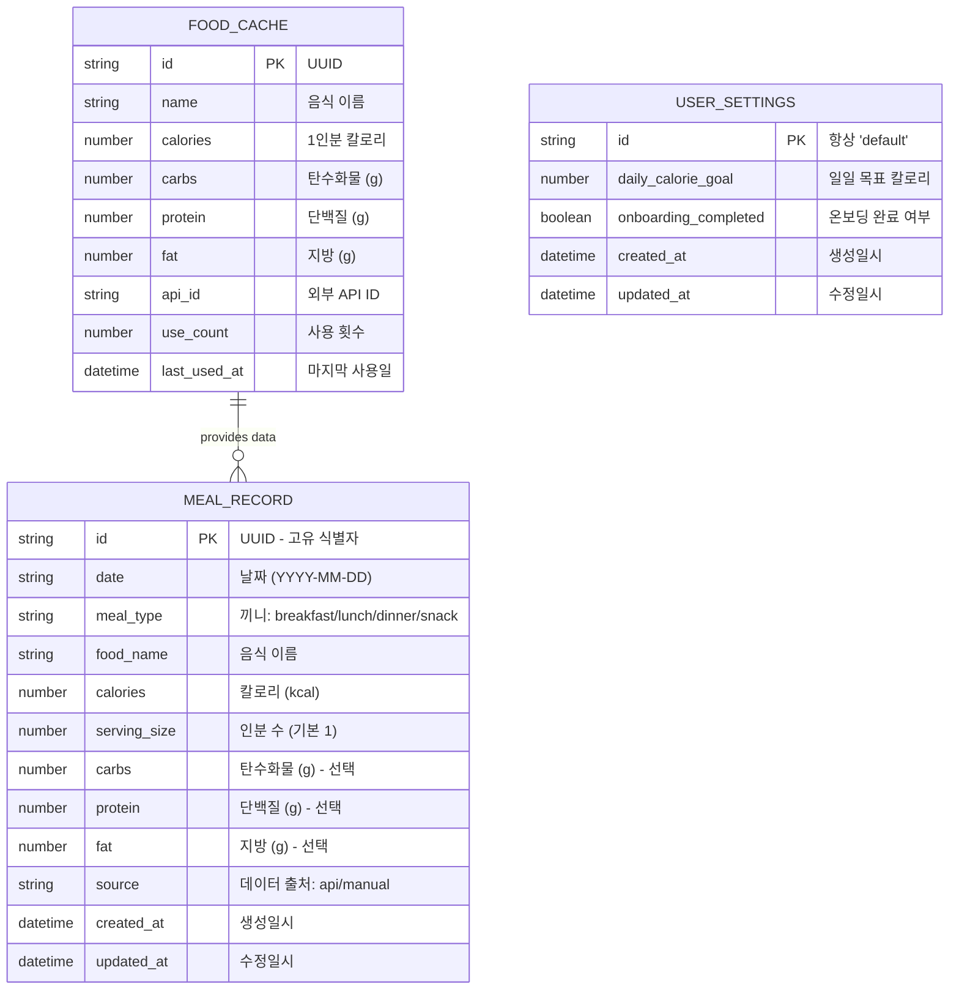
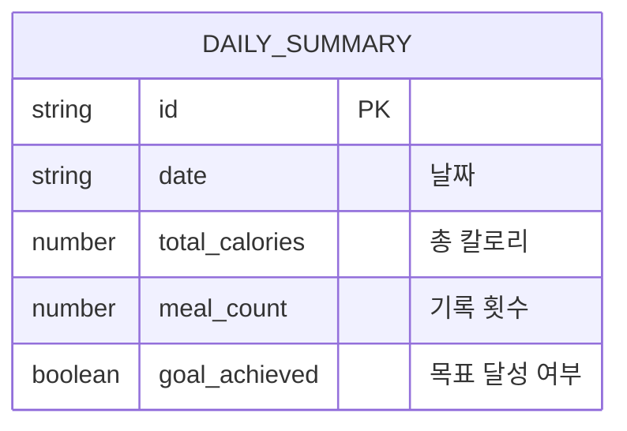

# Database Design (데이터베이스 설계) - 헬스메이트

> IndexedDB (Dexie.js) 기반 로컬 데이터베이스 설계입니다.
> 서버 DB 없이 브라우저 내에서 모든 데이터를 관리합니다.

---

## MVP 캡슐

| # | 항목 | 내용 |
|---|------|------|
| 1 | 목표 | 귀찮은 입력 과정을 간소화하여 식단을 꾸준히 기록할 수 있게 하기 |
| 2 | 페르소나 | 다이어트 중인 사람 |
| 3 | 핵심 기능 | FEAT-1: 간편 식단 기록 |
| 4 | 성공 지표 (노스스타) | 매일 3끼 기록 달성률 |
| 5 | 입력 지표 | 일일 기록 횟수, 주간 연속 기록 일수 |
| 6 | 비기능 요구 | 식단 입력 3초 이내 완료 |
| 7 | Out-of-scope | 운동 기록, 소셜, 다크 모드, 회원가입/로그인 |
| 8 | Top 리스크 | 입력 귀찮아서 3일 만에 포기 |
| 9 | 완화/실험 | 음식 검색 자동완성 + 최근 기록 재사용 |
| 10 | 다음 단계 | 식단 기록 화면 프로토타입 구현 |

---

## 1. ERD (Entity Relationship Diagram)



---

## 2. 엔티티 상세 정의

### 2.1 MEAL_RECORD (식단 기록) - FEAT-1

| 컬럼 | 타입 | 인덱스 | 설명 |
|------|------|--------|------|
| id | string | PK | UUID v4 자동 생성 |
| date | string | indexed | 날짜 (YYYY-MM-DD), 일별 조회용 |
| meal_type | string | indexed | breakfast / lunch / dinner / snack |
| food_name | string | - | 음식 이름 |
| calories | number | - | 칼로리 (kcal) |
| serving_size | number | - | 인분 수 (기본값: 1) |
| carbs | number | - | 탄수화물 (g), 선택 |
| protein | number | - | 단백질 (g), 선택 |
| fat | number | - | 지방 (g), 선택 |
| source | string | - | "api" (검색) 또는 "manual" (직접 입력) |
| created_at | Date | - | 생성 시각 |
| updated_at | Date | - | 수정 시각 |

**Dexie.js 인덱스:**
```typescript
meals: '++id, date, meal_type, [date+meal_type]'
```

### 2.2 FOOD_CACHE (음식 캐시) - FEAT-1

| 컬럼 | 타입 | 인덱스 | 설명 |
|------|------|--------|------|
| id | string | PK | UUID v4 |
| name | string | indexed | 음식 이름 (검색용) |
| calories | number | - | 1인분 기준 칼로리 |
| carbs | number | - | 탄수화물 (g) |
| protein | number | - | 단백질 (g) |
| fat | number | - | 지방 (g) |
| api_id | string | - | 외부 API의 음식 ID |
| use_count | number | indexed | 사용 횟수 (최근 기록 정렬용) |
| last_used_at | Date | indexed | 마지막 사용일 |

**Dexie.js 인덱스:**
```typescript
foodCache: '++id, name, use_count, last_used_at'
```

### 2.3 USER_SETTINGS (사용자 설정) - FEAT-0

| 컬럼 | 타입 | 인덱스 | 설명 |
|------|------|--------|------|
| id | string | PK | 항상 "default" (단일 레코드) |
| daily_calorie_goal | number | - | 일일 목표 칼로리 (기본값: 2000) |
| onboarding_completed | boolean | - | 온보딩 완료 여부 |
| created_at | Date | - | 생성 시각 |
| updated_at | Date | - | 수정 시각 |

**Dexie.js 인덱스:**
```typescript
settings: 'id'
```

---

## 3. Dexie.js 스키마 정의

```typescript
// db.ts
import Dexie, { type Table } from 'dexie';

export interface MealRecord {
  id?: string;
  date: string;           // "2026-02-12"
  meal_type: 'breakfast' | 'lunch' | 'dinner' | 'snack';
  food_name: string;
  calories: number;
  serving_size: number;
  carbs?: number;
  protein?: number;
  fat?: number;
  source: 'api' | 'manual';
  created_at: Date;
  updated_at: Date;
}

export interface FoodCache {
  id?: string;
  name: string;
  calories: number;
  carbs?: number;
  protein?: number;
  fat?: number;
  api_id?: string;
  use_count: number;
  last_used_at: Date;
}

export interface UserSettings {
  id: string;             // always "default"
  daily_calorie_goal: number;
  onboarding_completed: boolean;
  created_at: Date;
  updated_at: Date;
}

export class HealthMateDB extends Dexie {
  meals!: Table<MealRecord>;
  foodCache!: Table<FoodCache>;
  settings!: Table<UserSettings>;

  constructor() {
    super('healthmate');
    this.version(1).stores({
      meals: '++id, date, meal_type, [date+meal_type]',
      foodCache: '++id, name, use_count, last_used_at',
      settings: 'id'
    });
  }
}

export const db = new HealthMateDB();
```

---

## 4. 주요 쿼리 패턴

| 용도 | 쿼리 |
|------|------|
| 오늘 식단 조회 | `db.meals.where('date').equals('2026-02-12').toArray()` |
| 끼니별 조회 | `db.meals.where({date: '2026-02-12', meal_type: 'lunch'}).toArray()` |
| 오늘 총 칼로리 | `db.meals.where('date').equals(today).toArray()` → sum calories |
| 최근 먹은 음식 | `db.foodCache.orderBy('last_used_at').reverse().limit(10).toArray()` |
| 자주 먹는 음식 | `db.foodCache.orderBy('use_count').reverse().limit(10).toArray()` |
| 주간 데이터 (v2) | `db.meals.where('date').between(startDate, endDate).toArray()` |

---

## 5. 데이터 생명주기

| 엔티티 | 생성 시점 | 보존 기간 | 삭제 방식 |
|--------|----------|----------|----------|
| MEAL_RECORD | 식단 기록 시 | 영구 (사용자 삭제 전까지) | 사용자 직접 삭제 |
| FOOD_CACHE | 음식 검색/사용 시 | 영구 (캐시 초과 시 LRU) | 자동 정리 (100개 초과 시 오래된 것 삭제) |
| USER_SETTINGS | 앱 최초 실행 | 영구 | 앱 데이터 초기화 시 |

---

## 6. 확장 고려사항

### 6.1 v2에서 추가 예정



### 6.2 마이그레이션 전략

Dexie.js의 버전 관리 기능을 활용:

```typescript
// v2 마이그레이션 예시
this.version(2).stores({
  meals: '++id, date, meal_type, [date+meal_type]',
  foodCache: '++id, name, use_count, last_used_at',
  settings: 'id',
  dailySummary: '++id, date'  // 새 테이블 추가
});
```

---

## Decision Log

| ID | 항목 | 선택 | 근거 |
|----|------|------|------|
| D-D01 | 저장소 | IndexedDB (Dexie.js) | 로컬 저장 요구, 서버 DB 불필요 |
| D-D02 | ID 생성 | UUID v4 | 충돌 방지, 추후 클라우드 동기화 대비 |
| D-D03 | 날짜 형식 | YYYY-MM-DD 문자열 | 인덱스 검색 용이, 시간대 무관 |
| D-D04 | 음식 캐시 | 별도 테이블 | 검색 결과 재사용, 최근/자주 먹는 음식 빠른 조회 |
