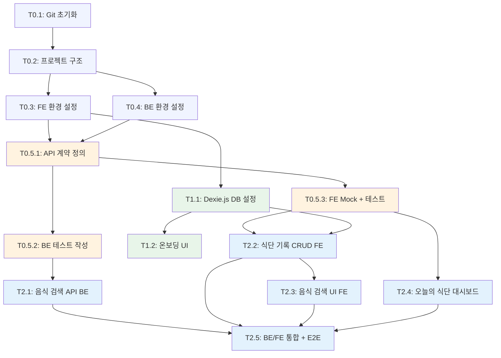

# TASKS: 헬스메이트 - 간편 식단 기록 PWA

## MVP 캡슐

| # | 항목 | 내용 |
|---|------|------|
| 1 | 목표 | 귀찮은 입력 과정을 간소화하여 식단을 꾸준히 기록할 수 있게 하기 |
| 2 | 페르소나 | 다이어트 중인 사람 |
| 3 | 핵심 기능 | FEAT-1: 간편 식단 기록 |
| 4 | 성공 지표 (노스스타) | 매일 3끼 기록 달성률 |
| 5 | 입력 지표 | 일일 기록 횟수, 주간 연속 기록 일수 |
| 6 | 비기능 요구 | 식단 입력 3초 이내 완료 |
| 7 | Out-of-scope | 운동 기록, 소셜, 다크 모드, 회원가입/로그인 |
| 8 | Top 리스크 | 입력 귀찮아서 3일 만에 포기 |
| 9 | 완화/실험 | 음식 검색 자동완성 + 최근 기록 재사용 |
| 10 | 다음 단계 | 식단 기록 화면 프로토타입 구현 |

---

## 기술 스택

| 영역 | 선택 |
|------|------|
| 프론트엔드 | React 18 + Vite + TypeScript + TailwindCSS + PWA |
| 상태관리 | Zustand |
| 로컬 DB | Dexie.js (IndexedDB) |
| 백엔드 | FastAPI (Python 3.11+) |
| 테스트 | Vitest + React Testing Library + MSW + pytest + Playwright |

---

## 마일스톤 개요

| 마일스톤 | 설명 | Phase | 태스크 수 |
|----------|------|-------|----------|
| M0 | 프로젝트 셋업 | Phase 0 | 4 |
| M0.5 | 계약 & 테스트 설계 | Phase 0 | 3 |
| M1 | FEAT-0: 온보딩 | Phase 1 | 2 |
| M2 | FEAT-1: 간편 식단 기록 (MVP 핵심) | Phase 2 | 5 |
| M3 | FEAT-2: 칼로리 상세 (v2) | Phase 3 | 2 |
| M4 | FEAT-3: 주간 리포트 (v2) | Phase 4 | 2 |

---

## 병렬 실행 가능 태스크

| 그룹 | 태스크 | 병렬 가능 |
|------|--------|----------|
| M0 셋업 | T0.1, T0.2 | T0.1 → T0.2 순차 |
| M0 셋업 | T0.3, T0.4 | T0.2 완료 후 T0.3 ∥ T0.4 병렬 가능 |
| M0.5 계약 | T0.5.1, T0.5.2, T0.5.3 | T0.5.1 → (T0.5.2 ∥ T0.5.3) |
| M1 온보딩 | T1.1, T1.2 | T1.1 → T1.2 순차 |
| M2 식단기록 | T2.1, T2.2 | T2.1(BE) ∥ T2.2(FE) 병렬 가능 (Mock 사용) |
| M2 식단기록 | T2.3, T2.4 | T2.3 ∥ T2.4 병렬 가능 (Mock 사용) |
| M2 통합 | T2.5 | T2.1~T2.4 완료 후 |

---

## 의존성 그래프



---

## M0: 프로젝트 셋업

### [ ] Phase 0, T0.1: Git 저장소 초기화

**담당**: frontend-specialist

**작업 내용**:
- Git 저장소 초기화
- `.gitignore` 생성 (Node.js + Python + IDE + .env)
- 초기 커밋

**산출물**:
- `.gitignore`
- 초기 커밋

**완료 조건**:
- [ ] `git status` 정상
- [ ] `.gitignore`에 node_modules, __pycache__, .env, dist 포함

---

### [ ] Phase 0, T0.2: 프로젝트 디렉토리 구조 생성

**담당**: frontend-specialist

**작업 내용**:
- 모노레포 디렉토리 구조 생성 (07-coding-convention.md 참조)
- `frontend/`, `backend/`, `contracts/`, `docs/` 구조

**산출물**:
```
healthmate/
├── frontend/src/{components,pages,hooks,utils,services,stores,types,db,mocks,__tests__}/
├── backend/app/{routes,schemas,services,utils}/
├── backend/tests/api/
├── contracts/
├── docs/planning/  (기존)
└── docker-compose.yml (빈 파일)
```

**완료 조건**:
- [ ] 모든 디렉토리 생성 완료
- [ ] 07-coding-convention.md 구조와 일치

---

### [ ] Phase 0, T0.3: 프론트엔드 환경 설정

**담당**: frontend-specialist

**작업 내용**:
- Vite + React + TypeScript 프로젝트 초기화
- TailwindCSS 설정 (05-design-system.md 컬러 토큰 포함)
- Zustand 설치
- Dexie.js 설치
- Vitest + React Testing Library 설정
- MSW 설치 및 기본 설정
- vite-plugin-pwa 설정
- ESLint + Prettier 설정
- `tailwind.config.ts`에 디자인 시스템 토큰 반영

**산출물**:
- `frontend/package.json`
- `frontend/vite.config.ts`
- `frontend/tailwind.config.ts`
- `frontend/tsconfig.json`
- `frontend/.eslintrc.cjs`
- `frontend/.prettierrc`

**완료 조건**:
- [ ] `npm run dev` 정상 실행
- [ ] `npm run test` 실행 가능 (테스트 0개 OK)
- [ ] `npm run lint` 통과
- [ ] TailwindCSS 컬러 토큰에 `primary: '#6B9080'`, `secondary: '#E8998D'` 등 포함
- [ ] PWA manifest 설정 완료

---

### [ ] Phase 0, T0.4: 백엔드 환경 설정

**담당**: backend-specialist

**작업 내용**:
- Python 가상환경 + FastAPI 프로젝트 초기화
- `requirements.txt` 작성 (FastAPI, uvicorn, httpx, pydantic, pytest, pytest-asyncio, pytest-cov, ruff)
- 기본 `main.py` (헬스체크 엔드포인트)
- CORS 설정
- `.env.example` 생성
- pytest 설정
- Ruff + Black 설정

**산출물**:
- `backend/requirements.txt`
- `backend/app/main.py`
- `backend/.env.example`
- `backend/pyproject.toml` (ruff, pytest 설정)

**완료 조건**:
- [ ] `uvicorn app.main:app` 정상 실행
- [ ] `GET /health` → `{"status": "ok"}`
- [ ] `pytest` 실행 가능
- [ ] `ruff check .` 통과

---

## M0.5: 계약 & 테스트 설계 (Contract-First)

### [ ] Phase 0, T0.5.1: API 계약 정의

**담당**: backend-specialist

**작업 내용**:
- 음식 검색 API 계약 정의 (TypeScript + Pydantic)
- 02-trd.md 섹션 8 응답 형식 준수

**산출물**:
- `contracts/types.ts` - 공통 타입
- `contracts/food.contract.ts` - 음식 검색 API 계약
- `backend/app/schemas/food.py` - Pydantic 스키마 (계약과 동기화)

**계약 예시**:
```typescript
// contracts/food.contract.ts
export interface FoodSearchRequest {
  query: string;
  limit?: number;  // default: 10
}

export interface FoodItem {
  name: string;
  calories: number;
  serving_size: string;
  nutrients: {
    carbs: number;
    protein: number;
    fat: number;
  };
  api_id?: string;
}

export interface FoodSearchResponse {
  data: FoodItem[];
  meta: {
    total: number;
    source: string;
  };
}
```

**완료 조건**:
- [ ] TypeScript 계약 파일 생성
- [ ] Pydantic 스키마가 TypeScript 계약과 동기화
- [ ] 응답 형식이 02-trd.md와 일치

---

### [ ] Phase 0, T0.5.2: 백엔드 테스트 작성 (RED)

**담당**: test-specialist

**작업 내용**:
- 음식 검색 API 테스트 작성 (T0.5.1 계약 기반)
- 모든 테스트는 아직 실패 상태 (RED) - 정상!

**산출물**:
- `backend/tests/api/test_food_search.py`

**테스트 케이스**:
```python
# 작성할 테스트 (모두 FAIL 예상)
def test_search_food_returns_results():
    """음식 검색 시 결과 반환"""

def test_search_food_empty_query():
    """빈 검색어 시 400 에러"""

def test_search_food_no_results():
    """검색 결과 없을 때 빈 배열"""

def test_search_food_response_format():
    """응답 형식이 계약과 일치"""
```

**완료 조건**:
- [ ] 테스트 파일 생성
- [ ] `pytest backend/tests/api/test_food_search.py` → 모든 테스트 FAIL (RED 상태)

---

### [ ] Phase 0, T0.5.3: 프론트엔드 Mock & 테스트 작성 (RED)

**담당**: test-specialist

**작업 내용**:
- MSW 핸들러 작성 (T0.5.1 계약 기반)
- 식단 기록 CRUD 테스트 작성 (Dexie.js 대상)
- 음식 검색 컴포넌트 테스트 작성
- 모든 테스트는 아직 실패 상태 (RED) - 정상!

**산출물**:
- `frontend/src/mocks/handlers/food.ts` - MSW 음식 검색 핸들러
- `frontend/src/mocks/data/food.ts` - Mock 음식 데이터
- `frontend/src/__tests__/db/mealRecord.test.ts` - 식단 기록 CRUD 테스트
- `frontend/src/__tests__/components/FoodSearch.test.tsx` - 음식 검색 테스트

**완료 조건**:
- [ ] MSW 핸들러 생성 (음식 검색 Mock API)
- [ ] `npm run test` → 모든 테스트 FAIL (RED 상태)

---

## M1: FEAT-0 온보딩

### [ ] Phase 1, T1.1: Dexie.js 데이터베이스 설정 RED→GREEN

**담당**: frontend-specialist

**Git Worktree 설정**:
```bash
git worktree add ../healthmate-phase1-onboarding -b phase/1-onboarding
cd ../healthmate-phase1-onboarding
```

**TDD 사이클**:

1. **RED**: 테스트 작성 (실패 확인)
   ```bash
   # 테스트 파일: frontend/src/__tests__/db/database.test.ts
   npm run test -- src/__tests__/db/database.test.ts  # Expected: FAILED
   ```

2. **GREEN**: 최소 구현 (테스트 통과)
   ```bash
   # 구현 파일: frontend/src/db/index.ts
   npm run test -- src/__tests__/db/database.test.ts  # Expected: PASSED
   ```

3. **REFACTOR**: 타입 정리, 에러 처리

**작업 내용**:
- Dexie.js DB 클래스 생성 (04-database-design.md 스키마 구현)
- `MealRecord`, `FoodCache`, `UserSettings` 테이블 정의
- 초기 설정값 시딩 (daily_calorie_goal: 2000)

**산출물**:
- `frontend/src/__tests__/db/database.test.ts` (테스트)
- `frontend/src/db/index.ts` (구현)
- `frontend/src/types/meal.ts` (타입 정의)

**인수 조건**:
- [ ] 테스트 먼저 작성됨 (RED 확인)
- [ ] DB 생성 및 테이블 존재 테스트 통과
- [ ] 초기 설정값 시딩 테스트 통과
- [ ] 커버리지 >= 80%

**완료 시 자동 실행**:
```bash
git add -A && git commit -m "$(cat <<'EOF'
기능: Dexie.js 데이터베이스 설정

- MealRecord, FoodCache, UserSettings 테이블 정의
- 초기 설정값 시딩 (daily_calorie_goal: 2000)
- 데이터베이스 단위 테스트 작성

태스크: Phase 1, T1.1
EOF
)"
git checkout main && git merge phase/1-onboarding --no-ff -m "병합: Phase 1 - 온보딩 DB 설정"
git worktree remove ../healthmate-phase1-onboarding && git branch -d phase/1-onboarding
```

---

### [ ] Phase 1, T1.2: 온보딩 UI RED→GREEN

**담당**: frontend-specialist

**Git Worktree 설정**:
```bash
git worktree add ../healthmate-phase1-onboarding-ui -b phase/1-onboarding-ui
cd ../healthmate-phase1-onboarding-ui
```

**TDD 사이클**:

1. **RED**: 테스트 작성 (실패 확인)
   ```bash
   # 테스트 파일: frontend/src/__tests__/pages/Onboarding.test.tsx
   npm run test -- src/__tests__/pages/Onboarding.test.tsx  # Expected: FAILED
   ```

2. **GREEN**: 최소 구현 (테스트 통과)
   ```bash
   # 구현 파일: frontend/src/pages/Onboarding.tsx
   npm run test -- src/__tests__/pages/Onboarding.test.tsx  # Expected: PASSED
   ```

3. **REFACTOR**: 컴포넌트 분리, 스타일 정리

**작업 내용**:
- 3장 슬라이드 온보딩 UI (03-user-flow.md FEAT-0 참조)
- 슬라이드 1: 식단 기록 안내
- 슬라이드 2: 칼로리 자동 계산 안내
- 슬라이드 3: 주간 리포트 안내 + "시작하기" 버튼
- UserSettings.onboarding_completed 업데이트
- 디자인: 05-design-system.md 컬러/타이포 적용

**산출물**:
- `frontend/src/__tests__/pages/Onboarding.test.tsx` (테스트)
- `frontend/src/pages/Onboarding.tsx` (구현)
- `frontend/src/components/ui/SlideCard.tsx` (슬라이드 컴포넌트)

**인수 조건**:
- [ ] 테스트 먼저 작성됨 (RED 확인)
- [ ] 3장 슬라이드 렌더링 테스트 통과
- [ ] "시작하기" 클릭 시 onboarding_completed = true 테스트 통과
- [ ] 커버리지 >= 80%

**완료 시 자동 실행**:
```bash
git add -A && git commit -m "$(cat <<'EOF'
기능: 온보딩 슬라이드 UI 구현

- 3장 슬라이드 (식단 기록, 칼로리 계산, 주간 리포트)
- 시작하기 버튼 → onboarding_completed 업데이트
- 디자인 시스템 컬러/타이포 적용

태스크: Phase 1, T1.2
EOF
)"
git checkout main && git merge phase/1-onboarding-ui --no-ff -m "병합: Phase 1 - 온보딩 UI"
git worktree remove ../healthmate-phase1-onboarding-ui && git branch -d phase/1-onboarding-ui
```

---

## M2: FEAT-1 간편 식단 기록 (MVP 핵심)

### [ ] Phase 2, T2.1: 음식 검색 API 구현 (BE) RED→GREEN

**담당**: backend-specialist

**Git Worktree 설정**:
```bash
git worktree add ../healthmate-phase2-food-api -b phase/2-food-api
cd ../healthmate-phase2-food-api
```

**TDD 사이클**:

1. **RED**: T0.5.2에서 작성한 테스트 확인
   ```bash
   # 테스트 파일: backend/tests/api/test_food_search.py
   pytest backend/tests/api/test_food_search.py -v  # Expected: FAILED
   ```

2. **GREEN**: 최소 구현 (테스트 통과)
   ```bash
   # 구현 파일: backend/app/routes/food.py, backend/app/services/food_api.py
   pytest backend/tests/api/test_food_search.py -v  # Expected: PASSED
   ```

3. **REFACTOR**: 에러 핸들링, 캐싱 로직 정리

**작업 내용**:
- `GET /api/v1/foods?q={query}` 엔드포인트 구현
- 외부 음식 DB API 호출 서비스 (httpx)
- 인메모리 캐싱 (TTL 기반)
- 에러 핸들링 (외부 API 실패 시 빈 배열 반환)
- 02-trd.md 응답 형식 준수

**산출물**:
- `backend/app/routes/food.py` (라우트)
- `backend/app/services/food_api.py` (외부 API 호출)
- `backend/app/schemas/food.py` (이미 T0.5.1에서 생성)

**인수 조건**:
- [ ] T0.5.2 테스트 모두 통과 (GREEN)
- [ ] `/api/v1/foods?q=김치` 검색 시 결과 반환
- [ ] 외부 API 실패 시 500이 아닌 빈 결과 반환
- [ ] 커버리지 >= 80%

**완료 시 자동 실행**:
```bash
git add -A && git commit -m "$(cat <<'EOF'
기능: 음식 검색 API 구현

- GET /api/v1/foods?q={query} 엔드포인트
- 외부 음식 DB API 프록시 + 인메모리 캐싱
- 에러 핸들링 (외부 API 실패 시 graceful 처리)

태스크: Phase 2, T2.1
EOF
)"
git checkout main && git merge phase/2-food-api --no-ff -m "병합: Phase 2 - 음식 검색 API"
git worktree remove ../healthmate-phase2-food-api && git branch -d phase/2-food-api
```

---

### [ ] Phase 2, T2.2: 식단 기록 CRUD (FE) RED→GREEN

**담당**: frontend-specialist

**의존성**: T1.1 (Dexie.js DB) - **이미 완료되어야 함**

**Git Worktree 설정**:
```bash
git worktree add ../healthmate-phase2-meal-crud -b phase/2-meal-crud
cd ../healthmate-phase2-meal-crud
```

**TDD 사이클**:

1. **RED**: T0.5.3에서 작성한 테스트 확인
   ```bash
   # 테스트 파일: frontend/src/__tests__/db/mealRecord.test.ts
   npm run test -- src/__tests__/db/mealRecord.test.ts  # Expected: FAILED
   ```

2. **GREEN**: 최소 구현 (테스트 통과)
   ```bash
   # 구현 파일: frontend/src/services/mealService.ts
   npm run test -- src/__tests__/db/mealRecord.test.ts  # Expected: PASSED
   ```

3. **REFACTOR**: 서비스 레이어 정리

**작업 내용**:
- 식단 기록 서비스 (Dexie.js CRUD)
  - `addMeal(record)` - 식단 추가
  - `getMealsByDate(date)` - 날짜별 조회
  - `updateMeal(id, data)` - 수정
  - `deleteMeal(id)` - 삭제
  - `getTodayCalories()` - 오늘 총 칼로리
- 음식 캐시 서비스
  - `cacheFoodItem(food)` - 검색 결과 캐싱
  - `getRecentFoods(limit)` - 최근 먹은 음식
  - `getFrequentFoods(limit)` - 자주 먹는 음식
- Zustand 스토어 (`useMealStore`)

**산출물**:
- `frontend/src/__tests__/db/mealRecord.test.ts` (이미 T0.5.3에서 생성)
- `frontend/src/services/mealService.ts` (구현)
- `frontend/src/services/foodCacheService.ts` (구현)
- `frontend/src/stores/mealStore.ts` (Zustand)

**인수 조건**:
- [ ] CRUD 테스트 모두 통과 (GREEN)
- [ ] 날짜별 조회 정상
- [ ] 오늘 총 칼로리 계산 정상
- [ ] 최근/자주 먹는 음식 조회 정상
- [ ] 커버리지 >= 80%

**완료 시 자동 실행**:
```bash
git add -A && git commit -m "$(cat <<'EOF'
기능: 식단 기록 CRUD 서비스 구현

- addMeal, getMealsByDate, updateMeal, deleteMeal
- 음식 캐시 서비스 (최근/자주 먹는 음식)
- Zustand 스토어 (useMealStore)

태스크: Phase 2, T2.2
EOF
)"
git checkout main && git merge phase/2-meal-crud --no-ff -m "병합: Phase 2 - 식단 기록 CRUD"
git worktree remove ../healthmate-phase2-meal-crud && git branch -d phase/2-meal-crud
```

---

### [ ] Phase 2, T2.3: 음식 검색 & 기록 추가 UI (FE) RED→GREEN

**담당**: frontend-specialist

**의존성**: T2.2 (식단 CRUD) - **이미 완료되어야 함**, T2.1 (BE API) - **Mock 사용으로 독립 개발 가능**

**Mock 설정**: T0.5.3에서 생성한 MSW 핸들러 사용

**Git Worktree 설정**:
```bash
git worktree add ../healthmate-phase2-food-search-ui -b phase/2-food-search-ui
cd ../healthmate-phase2-food-search-ui
```

**TDD 사이클**:

1. **RED**: 테스트 작성 (실패 확인)
   ```bash
   # 테스트 파일: frontend/src/__tests__/components/FoodSearch.test.tsx
   # 테스트 파일: frontend/src/__tests__/pages/AddMeal.test.tsx
   npm run test -- src/__tests__/components/FoodSearch.test.tsx src/__tests__/pages/AddMeal.test.tsx  # Expected: FAILED
   ```

2. **GREEN**: 최소 구현 (테스트 통과)
   ```bash
   # 구현 파일: frontend/src/components/meal/FoodSearch.tsx
   # 구현 파일: frontend/src/pages/AddMeal.tsx
   npm run test -- src/__tests__/components/FoodSearch.test.tsx src/__tests__/pages/AddMeal.test.tsx  # Expected: PASSED
   ```

3. **REFACTOR**: 컴포넌트 분리, 스타일 정리

**작업 내용** (03-user-flow.md FEAT-1 플로우 참조):
- 식단 기록 추가 페이지 (`AddMeal`)
  - 끼니 선택 탭 (아침/점심/저녁/간식)
  - 음식 검색 입력 (자동완성, 2글자 이상 시 검색)
  - 최근 먹은 음식 목록
  - 수량 조절 (0.5/1/1.5/2인분)
  - 저장 버튼
- 음식 검색 컴포넌트 (`FoodSearch`)
  - 검색 결과 목록
  - 검색 결과 없을 때 직접 입력 안내
  - 디바운싱 (300ms)
- 디자인: 05-design-system.md 적용 (FAB, 끼니 탭, 카드 등)

**산출물**:
- `frontend/src/__tests__/components/FoodSearch.test.tsx` (이미 T0.5.3에서 생성)
- `frontend/src/__tests__/pages/AddMeal.test.tsx` (테스트)
- `frontend/src/components/meal/FoodSearch.tsx` (구현)
- `frontend/src/components/meal/MealTypeTab.tsx` (구현)
- `frontend/src/components/meal/FoodItem.tsx` (구현)
- `frontend/src/pages/AddMeal.tsx` (구현)

**인수 조건**:
- [ ] 테스트 먼저 작성됨 (RED 확인)
- [ ] 끼니 선택 탭 렌더링 테스트 통과
- [ ] 음식 검색 → 결과 표시 테스트 통과 (MSW Mock)
- [ ] 음식 선택 → 칼로리 표시 테스트 통과
- [ ] 저장 → IndexedDB 저장 테스트 통과
- [ ] 커버리지 >= 80%

**완료 시 자동 실행**:
```bash
git add -A && git commit -m "$(cat <<'EOF'
기능: 음식 검색 & 식단 기록 추가 UI 구현

- 끼니 선택 탭 (아침/점심/저녁/간식)
- 음식 검색 자동완성 (디바운싱 300ms)
- 최근 먹은 음식 목록
- 수량 조절 + 저장

태스크: Phase 2, T2.3
EOF
)"
git checkout main && git merge phase/2-food-search-ui --no-ff -m "병합: Phase 2 - 음식 검색 UI"
git worktree remove ../healthmate-phase2-food-search-ui && git branch -d phase/2-food-search-ui
```

---

### [ ] Phase 2, T2.4: 오늘의 식단 대시보드 (FE) RED→GREEN

**담당**: frontend-specialist

**의존성**: T2.2 (식단 CRUD) - **Mock 사용으로 독립 개발 가능**

**Mock 설정**:
```typescript
// Dexie.js fake-indexeddb 사용
import 'fake-indexeddb/auto';
```

**Git Worktree 설정**:
```bash
git worktree add ../healthmate-phase2-dashboard -b phase/2-dashboard
cd ../healthmate-phase2-dashboard
```

**TDD 사이클**:

1. **RED**: 테스트 작성 (실패 확인)
   ```bash
   # 테스트 파일: frontend/src/__tests__/pages/Dashboard.test.tsx
   npm run test -- src/__tests__/pages/Dashboard.test.tsx  # Expected: FAILED
   ```

2. **GREEN**: 최소 구현 (테스트 통과)
   ```bash
   # 구현 파일: frontend/src/pages/Dashboard.tsx
   npm run test -- src/__tests__/pages/Dashboard.test.tsx  # Expected: PASSED
   ```

3. **REFACTOR**: 컴포넌트 분리

**작업 내용** (03-user-flow.md 메인 화면 참조):
- 메인 대시보드 페이지
  - 오늘 날짜 표시
  - 총 칼로리 (Display 크기, Secondary 컬러)
  - 목표 대비 진행률 바
  - 끼니별 기록 목록 (아침/점심/저녁/간식 섹션)
  - 각 기록: 음식명 + 칼로리 + 수량
  - 기록 탭 시 수정/삭제
  - FAB (+) 버튼 → AddMeal 페이지로 이동
- React Router 설정 (Dashboard, AddMeal, Onboarding)

**산출물**:
- `frontend/src/__tests__/pages/Dashboard.test.tsx` (테스트)
- `frontend/src/pages/Dashboard.tsx` (구현)
- `frontend/src/components/meal/MealCard.tsx` (구현)
- `frontend/src/components/meal/CalorieSummary.tsx` (구현)
- `frontend/src/components/ui/ProgressBar.tsx` (구현)
- `frontend/src/components/ui/FAB.tsx` (구현)
- `frontend/src/App.tsx` (라우팅)

**인수 조건**:
- [ ] 테스트 먼저 작성됨 (RED 확인)
- [ ] 오늘 식단 목록 렌더링 테스트 통과
- [ ] 총 칼로리 계산 표시 테스트 통과
- [ ] FAB 클릭 → AddMeal 네비게이션 테스트 통과
- [ ] 빈 상태 (기록 없음) 표시 테스트 통과
- [ ] 커버리지 >= 80%

**완료 시 자동 실행**:
```bash
git add -A && git commit -m "$(cat <<'EOF'
기능: 오늘의 식단 대시보드 구현

- 오늘 총 칼로리 + 목표 진행률 바
- 끼니별 식단 기록 목록
- FAB (+) 버튼 → 기록 추가
- React Router 설정

태스크: Phase 2, T2.4
EOF
)"
git checkout main && git merge phase/2-dashboard --no-ff -m "병합: Phase 2 - 대시보드"
git worktree remove ../healthmate-phase2-dashboard && git branch -d phase/2-dashboard
```

---

### [ ] Phase 2, T2.5: BE/FE 통합 및 E2E 테스트

**담당**: test-specialist

**의존성**: T2.1, T2.2, T2.3, T2.4 모두 완료 필수

**Git Worktree 설정**:
```bash
git worktree add ../healthmate-phase2-integration -b phase/2-integration
cd ../healthmate-phase2-integration
```

**TDD 사이클**:

1. **RED**: E2E 테스트 작성 (실패 확인)
   ```bash
   # 테스트 파일: frontend/e2e/meal-record.spec.ts
   npx playwright test  # Expected: FAILED
   ```

2. **GREEN**: Mock 제거 + 실제 API 연결
   ```bash
   npx playwright test  # Expected: PASSED
   ```

3. **REFACTOR**: 테스트 안정화

**작업 내용**:
- MSW Mock → 실제 FastAPI 연결 전환
- Docker Compose 설정 (BE + FE 동시 실행)
- E2E 테스트 시나리오 (Playwright)
  - 앱 실행 → 온보딩 → 시작하기
  - 음식 검색 → 선택 → 기록 저장
  - 대시보드에서 기록 확인
  - 기록 수정 및 삭제

**산출물**:
- `frontend/e2e/meal-record.spec.ts` (E2E 테스트)
- `docker-compose.yml` (BE + FE)
- `frontend/src/services/api.ts` (실제 API 클라이언트 - Mock 대체)

**인수 조건**:
- [ ] E2E 테스트 먼저 작성됨 (RED 확인)
- [ ] `docker-compose up` → BE + FE 정상 실행
- [ ] E2E: 온보딩 → 식단 기록 → 대시보드 확인 통과
- [ ] 모든 단위 테스트 유지 통과
- [ ] FE 커버리지 >= 80%, BE 커버리지 >= 80%

**완료 시 자동 실행**:
```bash
git add -A && git commit -m "$(cat <<'EOF'
기능: BE/FE 통합 및 E2E 테스트

- MSW Mock → 실제 FastAPI 연결
- Docker Compose 설정
- Playwright E2E 테스트 (온보딩→기록→확인)

태스크: Phase 2, T2.5
EOF
)"
git checkout main && git merge phase/2-integration --no-ff -m "병합: Phase 2 - 통합 테스트"
git worktree remove ../healthmate-phase2-integration && git branch -d phase/2-integration
```

---

## M3: FEAT-2 칼로리 상세 (v2)

> MVP 완료 후 진행

### [ ] Phase 3, T3.1: 영양소 상세 표시 RED→GREEN

**담당**: frontend-specialist

**작업 내용**:
- 음식별 탄수화물/단백질/지방 표시
- 하루 목표 칼로리 설정 기능
- 영양소 비율 시각화

---

### [ ] Phase 3, T3.2: 목표 칼로리 관리 RED→GREEN

**담당**: frontend-specialist

**작업 내용**:
- 일일 목표 칼로리 설정/수정
- 목표 초과 시 경고 표시
- 설정 페이지

---

## M4: FEAT-3 주간 리포트 (v2)

> MVP 완료 후 진행

### [ ] Phase 4, T4.1: 주간 데이터 집계 RED→GREEN

**담당**: frontend-specialist

**작업 내용**:
- 주간 칼로리 합계/평균 계산
- 자주 먹는 음식 TOP 5
- DailySummary 테이블 활용

---

### [ ] Phase 4, T4.2: 주간 리포트 차트 UI RED→GREEN

**담당**: frontend-specialist

**작업 내용**:
- 주간 칼로리 바 차트
- 영양소 비율 도넛 차트
- 자주 먹는 음식 리스트

---

## 다음 우선순위 작업

1. **T0.1**: Git 저장소 초기화
2. **T0.2**: 프로젝트 디렉토리 구조 생성
3. **T0.3 ∥ T0.4**: FE/BE 환경 설정 (병렬 가능)
4. **T0.5.1**: API 계약 정의
5. **T0.5.2 ∥ T0.5.3**: BE/FE 테스트 작성 (병렬 가능)
6. **T1.1 → T1.2**: 온보딩
7. **T2.1 ∥ T2.2**: 음식 API(BE) ∥ 식단 CRUD(FE) (병렬 가능!)
8. **T2.3 ∥ T2.4**: 검색 UI ∥ 대시보드 (병렬 가능!)
9. **T2.5**: 통합 테스트
